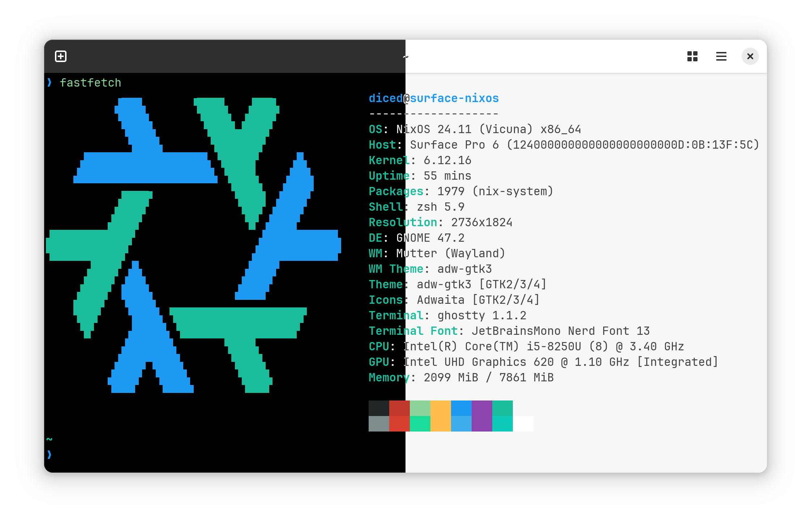
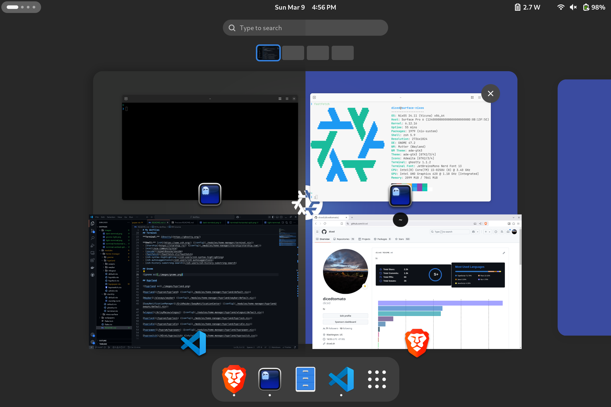
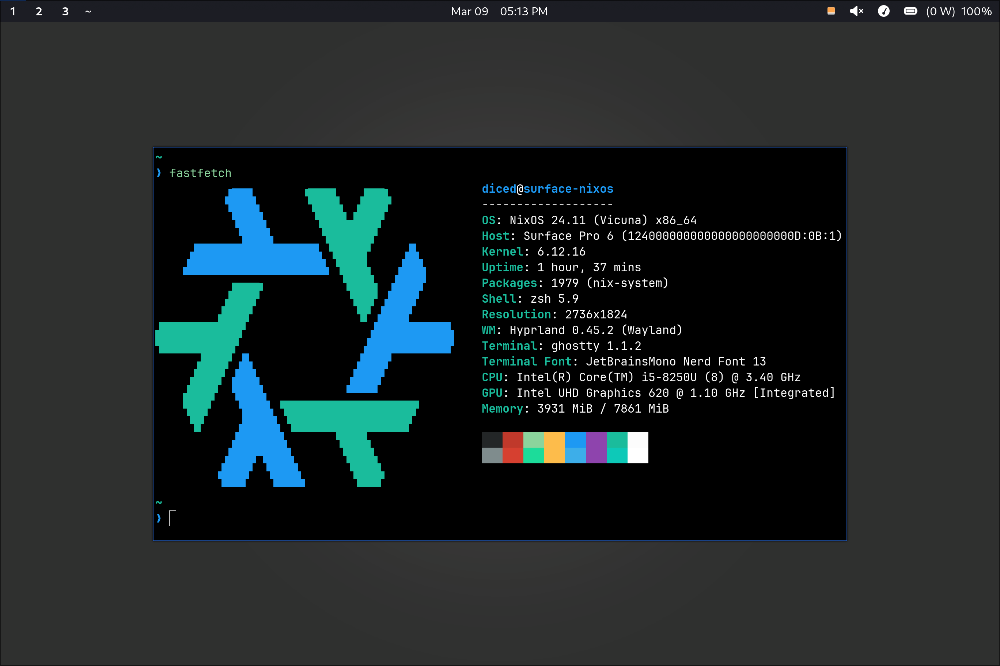

# My dotfiles

<details>
<summary>don't read!</summary>
<br>
✓ no anime :smiley: (pls don't kill me)
<br>
✓ minimalistic
<br>
✓ usable
</details>
<br><br>

**OS:** [NixOS](https://nixos.org/)

**WM:** [GNOME](#gnome) and [Hyprland](#hyprland)

**Editor:** [VSCode](#editor)

## Terminal



**Terminal:** [Ghostty](https://ghostty.org/)

**Shell:** [zsh](https://www.zsh.org/) ([config](./modules/home-manager/terminal.nix))

- [Starship](https://starship.rs/) ([config](./modules/home-manager/starship/starship.toml))
- [eza](https://github.com/eza-community/eza)
- [zoxide](https://github.com/ajeetdsouza/zoxide)
- [fastfetch](https://github.com/fastfetch-cli/fastfetch)
- [zsh-syntax-highlighting](https://github.com/zsh-users/zsh-syntax-highlighting)
- [zsh-autosuggestions](https://github.com/zsh-users/zsh-autosuggestions)
- [zsh-history-substring-search](https://github.com/zsh-users/zsh-history-substring-search)

## Gnome



[dconf settings](./modules/home-manager/gnome/default.nix)

- [Tailscale QS](https://github.com/joaophi/tailscale-gnome-qs)
- [Bluetooth Battery Meter](https://github.com/maniacx/Bluetooth-Battery-Meter)
- [Vitals](https://github.com/corecoding/Vitals)

## Hyprland



[Hyprland](https://github.com/hyprwm/hyprland) ([config](./modules/home-manager/hyprland/default.nix))

[Waybar](https://github.com/alexays/waybar) ([config](./modules/home-manager/hyprland/waybar/default.nix))

[SwayNotificationManager](https://github.com/ErikReider/SwayNotificationCenter) ([config](./modules/home-manager/hyprland/swaync/default.nix))

[wlogout](https://github.com/ArtsyMacaw/wlogout) ([config](./modules/home-manager/hyprland/wlogout/default.nix))

[hyprlock](https://github.com/hyprwm/hyprlock) ([config](./modules/home-manager/hyprland/hyprlock.nix))

[hypridle](https://github.com/hyprwm/hypridle) ([config](./modules/home-manager/hyprland/hypridle.nix))

[hyprpaper](https://github.com/hyprwm/hyprpaper) ([config](./modules/home-manager/hyprland/hyprpaper.nix))

[hyprswitch](https://github.com/H3rmt/hyprswitch) ([style](./modules/home-manager/hyprland/hyprswitch.css))

## Editor

[VSCode](https://code.visualstudio.com)

- Theme: [GitHub Theme](https://marketplace.visualstudio.com/items?itemName=GitHub.github-vscode-theme)
- Icon Theme: [JetBrains Icon Theme](https://marketplace.visualstudio.com/items?itemName=chadalen.vscode-jetbrains-icon-theme)

<details>
<summary>some of my extensions (click)</summary>

- [Docker](https://marketplace.visualstudio.com/items?itemName=ms-azuretools.vscode-docker)
- [ESLint](https://marketplace.visualstudio.com/items?itemName=dbaeumer.vscode-eslint)
- [Prettier](https://marketplace.visualstudio.com/items?itemName=esbenp.prettier-vscode)
- [Pretty TypeScript Errors](https://marketplace.visualstudio.com/items?itemName=YoavBls.pretty-ts-errors)
- [Tailwind CSS Intellisense](https://marketplace.visualstudio.com/items?itemName=bradlc.vscode-tailwindcss)
- [MDX](https://marketplace.visualstudio.com/items?itemName=unifiedjs.vscode-mdx)
- [Prisma](https://marketplace.visualstudio.com/items?itemName=Prisma.prisma)
- [Color Highlight](https://marketplace.visualstudio.com/items?itemName=naumovs.color-highlight)
- [WakaTime](https://marketplace.visualstudio.com/items?itemName=WakaTime.vscode-wakatime)
- [Luna Paint](https://marketplace.visualstudio.com/items?itemName=Tyriar.luna-paint)
- [Nix IDE](https://marketplace.visualstudio.com/items?itemName=jnoortheen.nix-ide)
- [GitHub Actions](https://marketplace.visualstudio.com/items?itemName=github.vscode-github-actions)
- [GitHub Copilot](https://marketplace.visualstudio.com/items?itemName=GitHub.copilot)
- [Remote Development](https://marketplace.visualstudio.com/items?itemName=ms-vscode-remote.vscode-remote-extensionpack)
- [Code Spell Checker](https://marketplace.visualstudio.com/items?itemName=streetsidesoftware.code-spell-checker)
- [Tinymist](https://marketplace.visualstudio.com/items?itemName=myriad-dreamin.tinymist)
</details>

## Configuring

```nix
{
  home-manager.users.diced.cfg = {
    enable = true;
    ghostty = true;
    starship = true;

    gnome.enable = true;

    hyprland = {
      enable = true;

      # the rest defaults to hyprland.enable, so you can omit them
      hypridle = true;
      hyprpaper = true;
      hyprlock = true;
      swaync = true;
      wlogout = true;
      udiskie = true;
      waybar = true;
    };
  };
}
```

example: [flake.nix](./flake.nix)

## Disclaimer

A bunch of these configs (especially hyprland) are taken from various different configs + my own styling changes. Also, this set of dots are super specific to me, so they probably wont work well for you!
